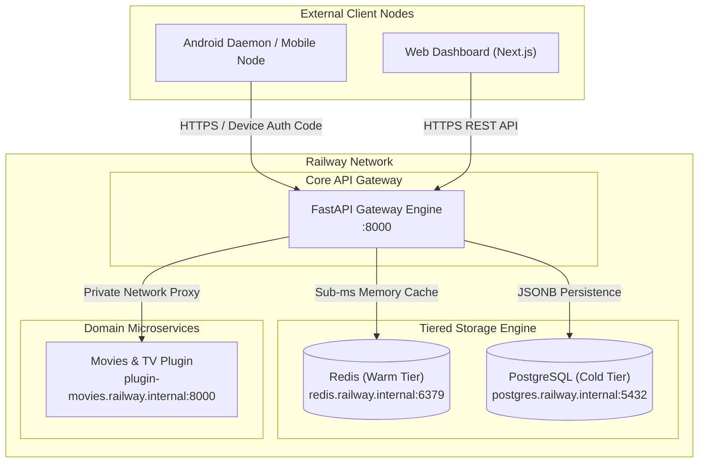
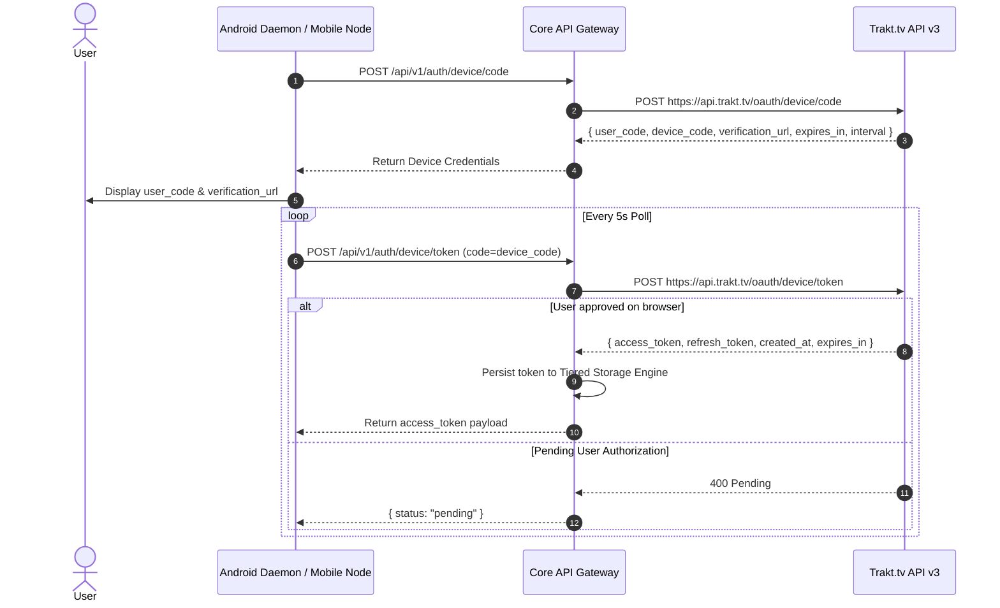

# Trakt Modular Ecosystem — Integration & Connection Guide

This guide specifies how client nodes (Web Portal, Android Background Daemon, Domain Microservices, and Third-Party Clients) authenticate, connect, and interact with the **Trakt Modular Ecosystem**.

---

## 1. Environment & Infrastructure Topology

The system runs on Railway using a **Headless Micro-Kernel** architecture. Core services communicate over Railway's private network (`*.railway.internal`), while client nodes connect via public HTTPS endpoints.



### Environment Base URLs

| Environment | Service | URL / Hostname |
| :--- | :--- | :--- |
| **Development** | Core Gateway | `https://backend-development-8adc.up.railway.app` |
| **Development** | Web Portal | `https://frontend-development-b9f7.up.railway.app` |
| **Production** | Core Gateway | `https://trakt-production-2e9b.up.railway.app` |
| **Production** | Web Portal | `https://frontend-production-b500c.up.railway.app` |
| **Private Internal** | Redis Warm Tier | `redis://default:<password>@redis.railway.internal:6379` |
| **Private Internal** | Postgres Cold Tier | `postgresql://postgres:<password>@postgres.railway.internal:5432/railway` |

---

## 2. API Endpoints & Reference Matrix

### System & Health Endpoints

#### 1. System Health Check
- **Method**: `GET /health`
- **Response**:
```json
{
  "status": "ok",
  "service": "trakt-gateway",
  "uptime_seconds": 412.8,
  "timestamp": 1785631088.015
}
```

#### 2. Core Cluster Telemetry
- **Method**: `GET /api/v1/system/status`
- **Response**:
```json
{
  "service": "trakt-core-gateway",
  "status": "healthy",
  "uptime": 412.8,
  "storage_engine": {
    "status": "online",
    "redis": "connected",
    "postgres": "connected",
    "memory_cache_entries": 0,
    "stats": {
      "hot_hits": 142,
      "cold_hits": 18,
      "fallback_hits": 0,
      "sets": 85,
      "deletes": 2,
      "errors": 0
    }
  },
  "environment": {
    "redis_configured": true,
    "database_configured": true
  }
}
```

---

## 3. OAuth Device Authentication Flow (Headless & Mobile Nodes)

Used by headless clients (Android Daemon, CLI tools, smart TVs) that lack interactive browser webview login forms.



### Step 1: Request Device Code
```bash
curl -X POST "https://backend-development-8adc.up.railway.app/api/v1/auth/device/code"
```
**Sample Response**:
```json
{
  "device_code": "d8a1c9e4b2",
  "user_code": "8B3-F7A",
  "verification_url": "https://trakt.tv/activate",
  "expires_in": 600,
  "interval": 5
}
```

### Step 2: Poll for Token Approval
```bash
curl -X POST "https://backend-development-8adc.up.railway.app/api/v1/auth/device/token?code=d8a1c9e4b2"
```

---

## 4. Domain Microservice Proxying

To fetch scrobbled watchlist items and Up-Next recommendations across domain microservices:

### Request Up Next Recommendations
- **Method**: `GET /api/v1/user/up-next?user_id={user_id}`
- **Sample Request**:
```bash
curl -s "https://backend-development-8adc.up.railway.app/api/v1/user/up-next?user_id=usr_998"
```
- **Sample Response**:
```json
{
  "source": "plugin_computed",
  "up_next": [
    {
      "id": "m1",
      "title": "Dune: Part Two",
      "type": "movie",
      "year": 2024,
      "progress_pct": 0,
      "runtime_min": 166,
      "rating": 8.6,
      "poster": "https://images.unsplash.com/photo-1534447677768-be436bb09401?w=400&q=80",
      "backdrop": "https://images.unsplash.com/photo-1534447677768-be436bb09401?w=1200&q=80",
      "genre": ["Sci-Fi", "Adventure"]
    },
    {
      "id": "s1",
      "title": "Severance",
      "type": "show",
      "year": 2022,
      "progress_pct": 75,
      "runtime_min": 55,
      "rating": 8.7,
      "poster": "https://images.unsplash.com/photo-1518709268805-4e9042af9f23?w=400&q=80",
      "backdrop": "https://images.unsplash.com/photo-1518709268805-4e9042af9f23?w=1200&q=80",
      "genre": ["Sci-Fi", "Thriller"],
      "next_episode": {
        "season": 2,
        "number": 1,
        "title": "Hello Ms. Cobel"
      }
    }
  ]
}
```

---

## 5. Client Integration Code Examples

### TypeScript / Next.js Client
```typescript
import axios from 'axios';

const API_BASE = process.env.NEXT_PUBLIC_API_URL || 'https://backend-development-8adc.up.railway.app';

export interface UpNextItem {
  id: string;
  title: string;
  type: 'movie' | 'show';
  year: number;
  progress_pct: number;
  rating: float;
}

export async function fetchUpNext(userId: string): Promise<UpNextItem[]> {
  try {
    const res = await axios.get(`${API_BASE}/api/v1/user/up-next`, {
      params: { user_id: userId }
    });
    return res.data.up_next || res.data.items || [];
  } catch (error) {
    console.error('Failed to fetch Up Next items from Trakt Gateway:', error);
    return [];
  }
}
```

### Python Client
```python
import httpx
import asyncio

API_BASE = "https://backend-development-8adc.up.railway.app"

async def check_trakt_status():
    async with httpx.AsyncClient() as client:
        res = await client.get(f"{API_BASE}/api/v1/system/status")
        print("Trakt Gateway Status:", res.json())

if __name__ == "__main__":
    asyncio.run(check_trakt_status())
```

### Kotlin (Android Scrobbler Daemon)
```kotlin
import okhttp3.OkHttpClient
import okhttp3.Request

class TraktApiClient(private val baseUrl: String = "https://backend-development-8adc.up.railway.app") {
    private val client = OkHttpClient()

    fun fetchHealth(): String? {
        val request = Request.Builder()
            .url("$baseUrl/health")
            .build()

        client.newCall(request).execute().use { response ->
            return response.body?.string()
        }
    }
}
```

---

## 6. Tiered Storage Mechanics

Data requests to the Core API Gateway pass through the `TieredStorageEngine`:

1. **Hot Payload Check ($\le 100\text{KB}$)**: Written directly to **Redis** with a 3600-second TTL. Sub-millisecond read latency.
2. **Cold Payload Offload ($>100\text{KB}$ or `is_big_object=True`)**:
   - Heavy raw JSON blob stored in **PostgreSQL** table `trakt_cold_storage`.
   - Lightweight reference pointer `{"_cold_ref": key, "size_bytes": 104200}` stored in **Redis**.
3. **Automatic Rehydration**: On cache miss, data is read from PostgreSQL and re-populated into Redis for fast subsequent reads.
